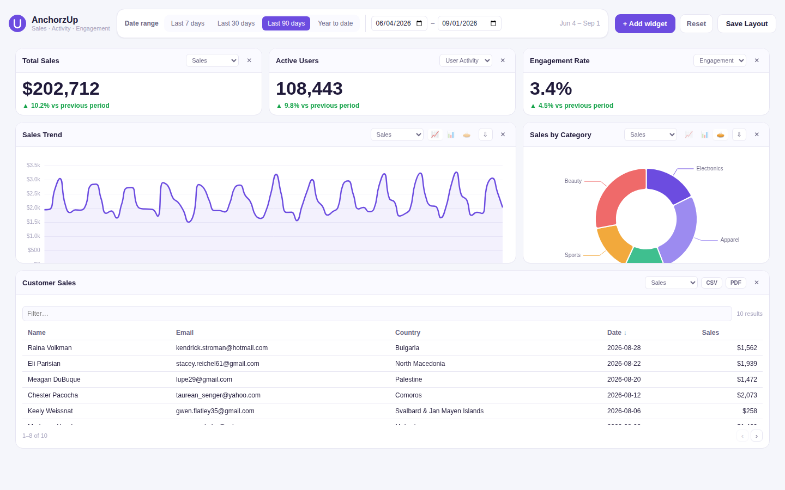

# AnchorzUp Dashboard

A dynamic, customizable analytics dashboard built with Angular — the technical task for AnchorzUp's Frontend Software Developer role.



## Contents

- [What's implemented](#whats-implemented)
- [Tech stack](#tech-stack)
- [Getting started](#getting-started)
- [Project structure](#project-structure)
- [Architecture notes](#architecture-notes)
- [Design decisions worth knowing about](#design-decisions-worth-knowing-about)
- [Testing](#testing)
- [Possible next steps](#possible-next-steps)

## What's implemented

Every required item in the brief, plus both bonus items.

**Layout**
- Grid-based layout (Angular Gridster 2). Every widget is draggable and resizable, resizes snap to the grid, and the layout is responsive — it reflows to a fixed 12‑column grid on desktop/tablet and automatically collapses to a single stacked column below 720px, where drag/resize turn off since there's nothing left to rearrange.

**Widgets**
- Stat cards with a live KPI, a delta vs. the previous period of equal length, and a per-widget dataset switcher.
- Charts (line / bar / pie), switchable per widget, backed by Apache ECharts.
- A table with sorting (click any header), pagination, and free-text filtering across name/email/country.

**Interactivity**
- A global date-range filter (presets + a custom range picker) updates every visible widget simultaneously.

**Persistence**
- Widget layout (position, size, visibility) and per-widget settings (dataset, chart type) are saved to `localStorage` and restored on reload. Global filters persist too.

**Data**
- Realistic mock data generated with [Faker.js](https://fakerjs.dev/), served through services that return `Observable`s with artificial network latency — so it behaves like a real API (including per-widget loading states), without needing an actual backend.

**Bonus**
- **Export** — every table and chart can export its data: CSV or PDF for tables, PNG-embedded PDF for charts.
- **Zoom, tooltips & drill-down** — the trend (line) view has an interactive zoom slider; bar/pie views use rich ECharts tooltips and support click-to-drill-down into a category's sub-categories, with a breadcrumb back out.

## Tech stack

| Concern | Choice | Why |
|---|---|---|
| Framework | Angular 19, standalone components, zoneless-friendly signals | Current idiomatic Angular — no `NgModule`s, `OnPush` everywhere, native control flow (`@if`/`@for`/`@switch`). |
| State | Hand-rolled signal store (`DashboardStore`) | See [Architecture notes](#architecture-notes) — this app has one real slice of shared state, so `signal`/`computed`/`effect` cover it without NgRx's ceremony. |
| Data fetching | Angular's `resource()` / `rxResource()` (`@angular/core/rxjs-interop`) | A TanStack-Query-style primitive: request derived from signals in, `value()`/`isLoading()`/`error()` signals out, automatic cancel-and-refetch on request change. No manual subscribe/unsubscribe anywhere in the widgets. |
| Grid / drag / resize | [`angular-gridster2`](https://github.com/tiberiuzuld/angular-gridster2) | Purpose-built for exactly this brief: draggable + resizable grid items, push-to-avoid-overlap, and a built-in mobile breakpoint that collapses the grid to a stacked list. |
| Charts | [Apache ECharts](https://echarts.apache.org/) via [`ngx-echarts`](https://github.com/xieziyu/ngx-echarts) | Native `dataZoom`, rich tooltips and click events made all three bonus chart features straightforward, instead of needing extra plugins. |
| Mock data | [`@faker-js/faker`](https://fakerjs.dev/) (seeded) | Realistic names/emails/countries and a full trailing year of daily metrics, generated once and seeded so the dashboard looks the same on every reload instead of jittering. |
| Export | [`jsPDF`](https://github.com/parallax/jsPDF) + `jspdf-autotable` | Table → PDF via `autoTable`; chart → PDF by embedding the chart's own `getDataURL()` PNG. |
| Tests | Karma + Jasmine (Angular CLI default) | `DashboardStore`, `MockDataService` and `TableWidgetComponent` have focused unit tests — see [Testing](#testing). |

## Getting started

Requires **Node.js 18.19+ / 20.11+ / 22.11+** and npm. (Built and verified against Node 22 / Angular CLI 19.)

```bash
npm install
npm start        # ng serve — http://localhost:4200

npm run build     # production build to dist/anchorzup-dashboard
npm test          # unit tests (Karma + Jasmine, headless Chrome)
```

No environment variables, API keys, or backend are required — everything runs client-side against the mock data service.

## Project structure

```
src/app/
  core/
    models/          # WidgetConfig, dataset shapes, shared types
    services/         # MockDataService (fake API), PersistenceService (localStorage),
                       # ExportService (CSV/PDF)
    state/             # DashboardStore — the single signal-based source of truth
    utils/             # date-range helpers
  shared/
    components/
      filter-bar/       # global date-range control
      widget-picker/     # "+ Add widget" popover (also restores hidden widgets)
      widget-frame/       # shared widget chrome: drag handle, title, remove, loading state
  features/
    dashboard/
      dashboard.component.*   # the page: gridster wiring + toolbar
      widgets/
        stat-card-widget/
        chart-widget/
        table-widget/
```

Each widget component owns its own data fetching (via `rxResource`) and renders itself inside the shared `WidgetFrameComponent`; `DashboardComponent` only wires gridster events and widget outputs back into `DashboardStore`. `DashboardStore` is the only place layout or settings are ever mutated.

## Architecture notes

**Why a hand-rolled signal store instead of NgRx.** This dashboard has exactly one meaningful piece of shared state: the widget list and the active filters, read by a handful of sibling components. NgRx (classic or Signal Store) earns its ceremony — actions, reducers/methods, selectors — on apps with several independent feature domains, cross-cutting effects, or a team that wants an enforced, uniform data-flow convention. Here it would only add a layer of indirection between "the user dragged a card" and the one array that needs to change. Angular's own `signal()` / `computed()` / `effect()` give the properties that actually matter for a dashboard this size — one mutable source of truth, cheaply-derived state, and `OnPush` change detection everywhere — and `effect()` is what makes persistence a one-liner: it re-runs whenever `widgets` or `filters` change and (debounced) writes the new snapshot to `localStorage`, so no component has to remember to call "save". If this grew into a multi-page app with independent domains (auth, billing, admin…), promoting this to an NgRx **Signal Store** per feature would be the natural next step — it's built on the same primitives, so it's additive, not a rewrite.

**Why `rxResource()` for data fetching.** Every widget's data need is really "given these inputs (dataset, date range, drill path), fetch this and give me `value`/`isLoading`/`error`". `rxResource()` (from `@angular/core/rxjs-interop`, currently `@experimental` but shipped and stable-shaped) takes a signal-derived `request` and an RxJS `loader`, and handles request-changed → cancel-in-flight → refetch automatically. It reads like React Query/SWR, but is native to Angular and needs no extra dependency.

**Why chart type changes the query, not just the visualization.** Line charts show a *trend* (the dataset's daily time series); switching to bar or pie switches to a *category breakdown* of the same dataset. That's a deliberate product decision, not an accident: it's what makes drill-down meaningful (there's nothing to drill into on a time series) and it's why zoom lives on the trend view (zooming into a date range) while bar/pie lean on rich tooltips and click-to-drill instead. Each bonus chart feature ends up demonstrated where it's actually useful, rather than bolted onto every chart type uniformly.

**Widget chrome vs. widget content.** `WidgetFrameComponent` owns everything every widget needs regardless of type — the drag handle (scoped to the header only, via gridster's `dragHandleClass`, so dragging never fights with scrolling a table or hovering a chart), the title, a remove button, and a loading overlay — via a `frame-controls` content-projection slot for widget-specific controls (dataset/chart-type pickers). Each widget component only implements what's actually different about it.

## Design decisions worth knowing about

- **The mock-up's filter dropdowns became a proper global filter bar.** The reference design showed "Dataset"/date dropdowns floating inside the grid, next to a stat card — reading more like a leftover widget than a control. Since the brief specifically wants *global* filters that affect *every* widget, they were promoted into a dedicated toolbar above the grid, with per-widget dataset overrides kept where they were (each widget's header) so "choose which data source each widget shows" still works exactly as specified.
- **The "Angular" placeholder logo mark in the mock-up** was swapped for an AnchorzUp-styled mark using the brand's purple, since the original was clearly a placeholder (it's literally the Angular shield icon).
- **Empty/hidden state:** removing a widget hides it (not deletes it) — it reappears in "+ Add widget → Hidden widgets" so it's non-destructive, and reset-to-defaults is one click away if things get messy while testing drag/resize.

## Testing

```bash
npm test
```

Covers:
- `DashboardStore` — default layout, add/remove/hide/restore widgets, settings patches, date-range preset resolution, and the debounced localStorage persistence round-trip.
- `MockDataService` — series/breakdown/table queries respect the requested date range, breakdown slices sum back to the range total, drill-down returns real sub-categories, and `formatByUnit` formats currency/percent/count correctly.
- `TableWidgetComponent` — sort-column toggling (ascending → descending → new column resets to ascending) and the filter/metric-formatting logic.

## Possible next steps

Left out on purpose to keep the review focused on the brief — happy to talk through any of these:

- Server-side persistence (a real "mock backend" service) instead of `localStorage`, for multi-device sync.
- Drag-and-drop from the widget picker directly onto a grid position, instead of appending to the bottom.
- A saved-views feature (multiple named layouts, not just one).
- E2E coverage (Playwright) for the drag/resize/export flows, on top of the current unit tests.
